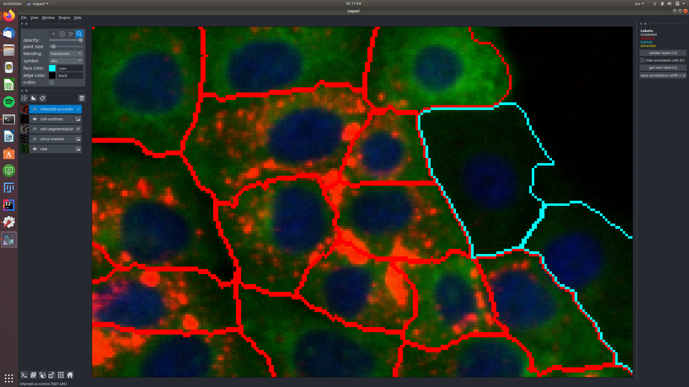
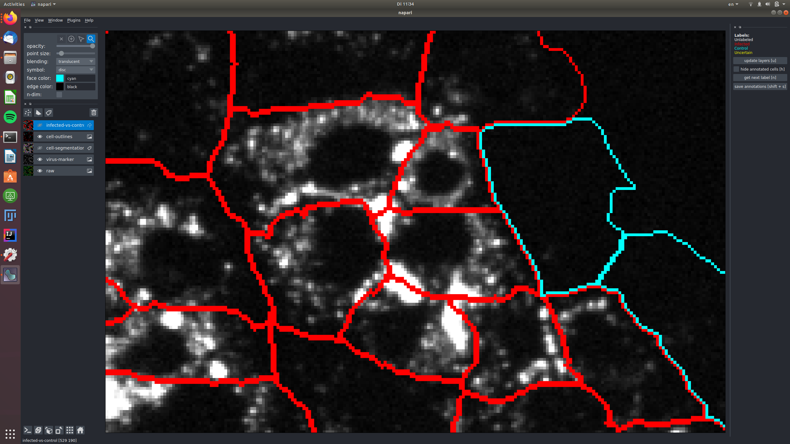
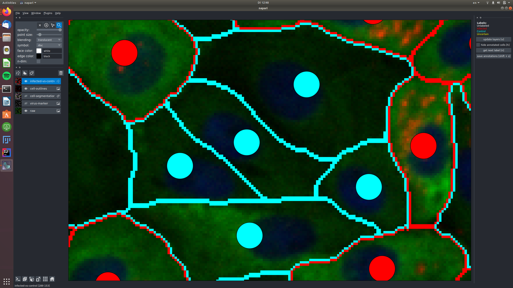
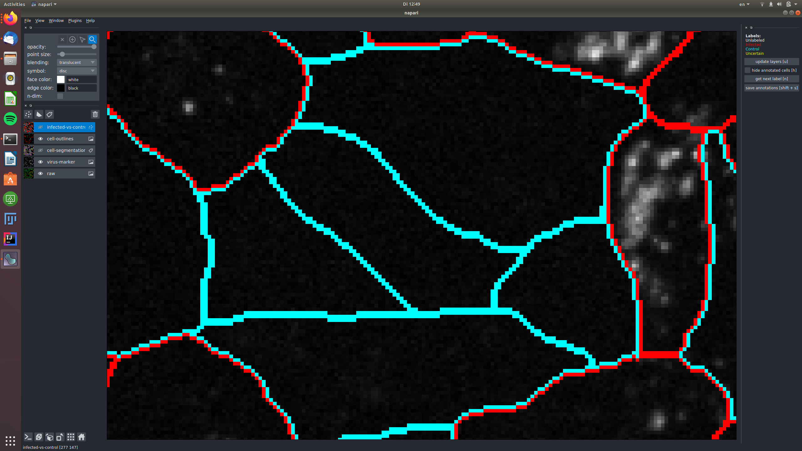
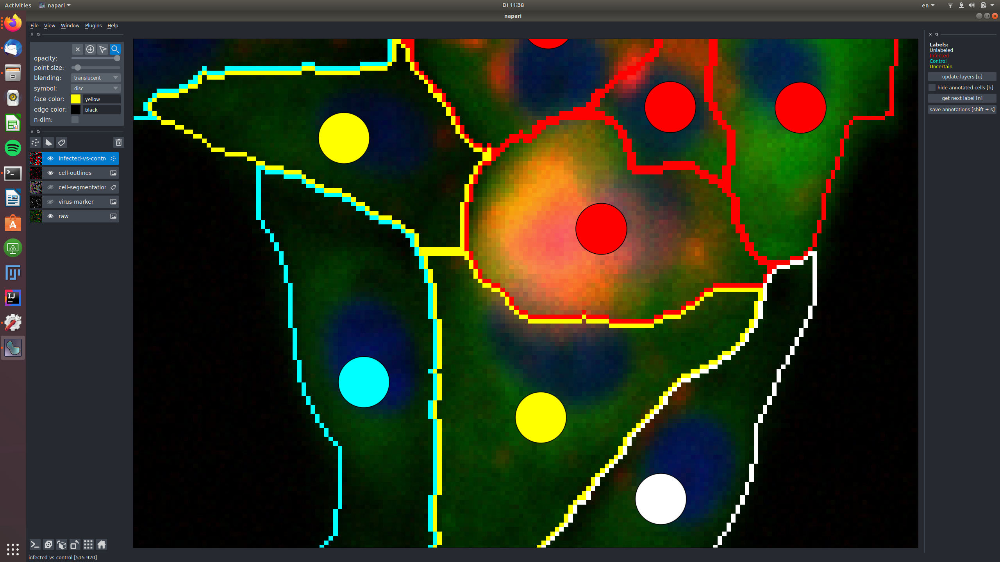
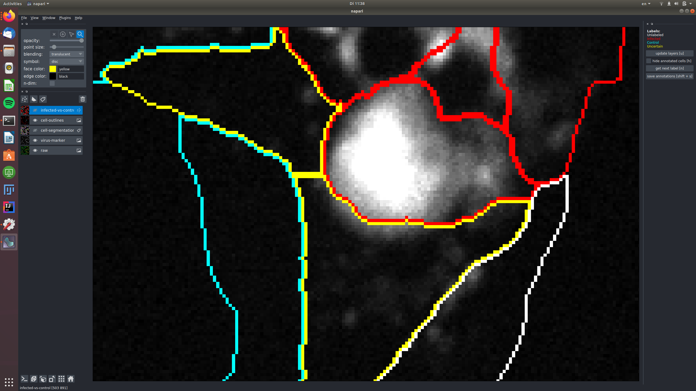
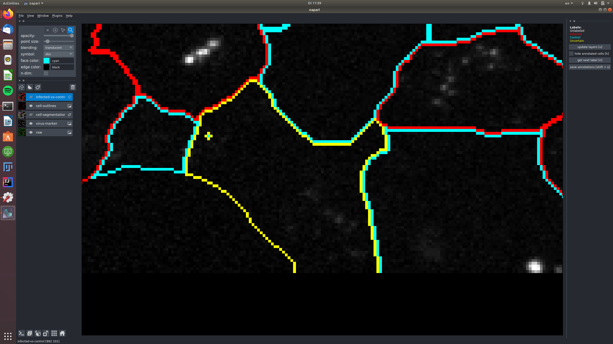

# covid-if-annotation-tool

Annotation Tool for immunofluorescence assay images

----------------------------------

## Getting Started

### Basis of the assay

The images you will annotate come from an immunofluorescence assay for measurung the antibody response of human serum to COVID19.
The raw images from the micropscope contain 3 different channels:
- The serum channel, that contains the blood serum to be tested as well as cells from a cell line. Some of these cells are infected with COVID19, some are not infected. In the following, we will refer to the infected cells as "infected" and to the non-infected cells as "control". One of the main tasks is to label whether a given cell is "infected" or "control" (or "uncertain" if you cannot tell). In our tool, you can see this channel as green color in the layer "raw".
- The virus marker channel, that shows where viral RNA is being expressed. In our tool, you can see this channel as red color in "raw" and we have also added a separate layer "virus-marker" that only shows this channel.
- A DAPI channel that stains the cell nuclei, you can see it in the layer "raw" as blue.

In order to automatically determine whether a sample shows a response or not, we apply machine learning to segment the individual cells and classify whether they are "inected" or "control".
To this end, we need more ground-truth to obtain reliable results, hence this tool :).

### The  aim of this software

It allows you to manually annotate 2D images of cells, starting from an exisitng and partially wrong cell segmentation. Two kinds of annotations are supported: 1) correcting the provided segmentation and 2) assigning one of the predefined labels to segmented cells. **We would greatly appreciate labels of both kinds!**

You can find a [short video demonstrating the tools functionality here.](https://www.youtube.com/watch?v=IwpRrX_PDFo&feature=youtu.be).

### Contact us

If you have feedback or run into issues join the "COVID-IF-annotations" channel on [https://chat.embl.org](https://chat.embl.org/) or contact us directly.

## Step-by-step guide

### Download and install the software

You can download the software here:

- [Windows](https://files.ilastik.org/covid-if-annotations-setup-latest.exe).
- [Mac](https://files.ilastik.org/covid-if-annotations-app-latest.tar.bz2)
- For Linux, [install via conda](https://github.com/hci-unihd/covid-if-annotations#install-via-conda)

Installation:

- MacOS: download the file, double-click to extract the .app file from the archive. Right-click the .app file and select "Open" from the menu. It will ask if you are sure, since you have downloaded this file from here and not from the app store. Press the "Open" button and the tool main window should appear.
- Windows: TBA

### Download an image to annotate

To obtain an image for annotation
- Visit [https://annotate.embl.de/](https://annotate.embl.de/) (only available from within the EMBL network, use VPN if you are not on campus)
- `Register` and `Login`
- Go to `Download` and press `Download Image` to get a new image

### Open the input image

Drag-and-drop the .h5 file you downloaded into the tool or use the File->Open menu item. After you do this, you should see an image like this:

  

The multi-colored overlay shows the preliminary cell segmentation we have obtained with our current pipeline. In the lower half of the left part of the window you see a list of displayed overlays, which you can turn on and off by clicking on the eye icon or configure using the controls in the upper left. 
The white dots in the middle of each cell show the label assigned to it. In the beginning, all cells are white, i.e. Unlabeled. If you start from an existing project, you will also see red("infected"), cyan("control") and yellow("uncertain") labels.

### Label cells

To understand whether a cell is infected you will need to look at the channel showing the virus marker. We saved it as a separate overlay, here is what you should see if you make it visible and turn off the rest:

  

Zoom in closer by scrolling and start inspecting indvidual cells. Turn off the segmentation overlay and turn on the cell outlines to see what's happening inside cells. Here is what it looks like:

 

The red  channel in the raw data corresponds to the virus-marker overlay, but we chose to also show it separately because it's so important for the infected/control decisions. 

Now, **get ready for labeling**: make the infected-vs-control overlay visible and active (click on the eye and also somewhere else on the rectangle with the "infected-vs-control" words. You should now see this layer high-lighted. Go to the topmost 4 buttons and activate the "mouse" one as shown here:

 

That's it, you can now click on the white circles to give them labels! If you click and nothing happens, make sure the mouse is activated as shown above! To get the next color in the list, just click again. Don't forget, the yellow label is there for the cells where you can't decide. Here are my results after a few clicks:

 

#### How to tell "infected" vs "control" vs "uncertain"

Cells should be labeled as "infected", if they show signal in the "virus-marker". If they don't show any signal, they should be labeled as "control".
Note that it is sometimes not easy to tell exactly which category to put a cell in, because the channel is noisy, or signal might be spilling over from an adjacent cell.
If you are unsure, label the cell as "uncertain".

See for example this group of cells that are infected and labeled such, shown in the raw and in the virus marker:
 
 

The central cells in this image are all not infected and labeled as "control", again shown in the raw and in the virus marker:
 
 

In this example, two cells were labeled as "uncertain", because the signal in the virus marker channel might be spilling over
from an infected cell.
 
 

In this example, a cell was labeled as "uncertain", because it shows only very weak signal in the virus marker channel, that might be noise.
 
 


### Correct cell segmentations
The segmentations you see here were produced by our current pipeline. They are automatic and thus not perfect. Here is what you do if you notice a segmentation error:

1. make the cell-segmentatioon overlay active by clicking on it. You should now see a different row of controls on the very top. 
 

Now the pipette is for the color picker, the drop for filling and the pen for drawing. 

2. locate the cell you want to correct and select its color with the color picker. In the example below, I will make the dark gray cell larger. Note, how the "label" field in the upper left configuration pane now shows the label I selected, by color and by numeric id.
 

3. select the pen tool and paint on top of other cells to re-assign their pixels to the cell whose color you picked. I painted and my cell got better (what do I know, I'm not a cell biologist. At least it's now different).

 
4. To see the changes you have made to the segmentation in the "infected-vs-control" and "cell-outlines", press "u".
5. Now what if you want to paint a new cell that we missed? Press "n" on your keyboard to activate a new, unused label. Then paint your  new cell. Done!

Keep going until you have all the cells labeled and all segmentation errors fixed.
**Don't forget to save your results frequently by pressing "shift + s"!**
The results will be saved to a file called `"IMAGE_NAME_annotations.h5" in the same folder where you store the image.`

In order to see your progress and find the cells you still need to label, you can press "h" to hide the boundaries in "cell-outlines" for the cells which you have annotated already.

If you get really tired or bored and can't do the whole image, send us the partial result, that would already be very helpful! You can also take a break and [load the saved annotations](https://github.com/hci-unihd/covid-if-annotations#reload-saved-results) again to continue later.

### Reload saved results

In order to continue labeling, you can reload the saved annotations:
- Open the tool again and open the original image file.
- Next, drag'n'drop the annotation results onto the viewer.
- This will replace the initial segmentation with your corrections and also load the cell labels.

### Upload your results

- Go to [https://annotate.embl.de/](https://annotate.embl.de/)
- Log in with your account
- Go to `Upload`
- Click `Browse...` and select your annotation result.
- Press `Upload Images`


## For Developers

In order to install the tool, either from the conda package or from source, you will need conda or miniconda.
If you don't have either installed yet, we recommend to install miniconda.
[For this, please download the installer and follow the installation instructions.](https://docs.conda.io/en/latest/miniconda.html)

### Install via conda

Open a terminal and make sure your conda is activated.
Then run the following commands:

```
conda create -c conda-forge -c ilastik -n covid-if-annotations covid-if-annotations
conda activate covid-if-annotations
```

You can then run the plugin via the command
```
covid_if_annotations
```

TODO we need to build this conda-package

### Install from source

In order to install the software, open a terminal, clone this repository
Set up a conda environment with all dependencies and activate it:

```
conda create -c conda-forge -n covid-if-annotations napari scikit-image h5py pandas
conda activate covid-if-annotations
```
Then install this tool using pip:
```
pip install -e .
```

After installing the plugin, you can run
```
covid_if_annotations
```
to launch the annotation tool. Drag and drop data to annotate onto the viewer.
Or you can start the tool with data already via:
```
covid_if_annotations --path /path/to/data.h5
```

If you don't have access to the EMBL intranet, we provide to different example images:
- [example data with initial infected labels](https://oc.embl.de/index.php/s/IghxebboVxgpraU)
- [example data without initial infected labels](https://oc.embl.de/index.php/s/OhrWtVXZ7GwbKoc)


## Keybindings:
- `u` update point and edge layer from the segmentation corrections and semantic annotations.
- `h` toggle visibility of already annotated segments.
- `n` get next label
- `Shift + s` save the current annotations (segmentation + infected-vs-control labels)


## Acknowledgements

This [napari] plugin was generated with [Cookiecutter] using with [@napari]'s [cookiecutter-napari-plugin] template.

<!--
Don't miss the full getting started guide to set up your new package:
https://github.com/napari/cookiecutter-napari-plugin#getting-started

and review the napari docs for plugin developers:
https://napari.org/docs/plugins/index.html
-->

## Contributing

Contributions are very welcome. Tests can be run with [tox], please ensure
the coverage at least stays the same before you submit a pull request.

## License

Distributed under the terms of the [MIT] license,
"napari-covid-if-annotations" is free and open source software
